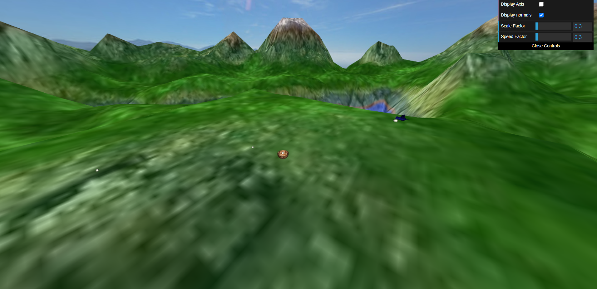

# PROJECT READ ME
sources : https://www.transparentpng.com/download/leafless-tree-images_6419.html
https://pngtree.com/free-tree-png

In the final version, the bird starts with an egg imediatally under it so you can press 'P' without moving the bird in order for it to catch the egg. Finally, you can press 'O' to throw it in a parabolic motion.

